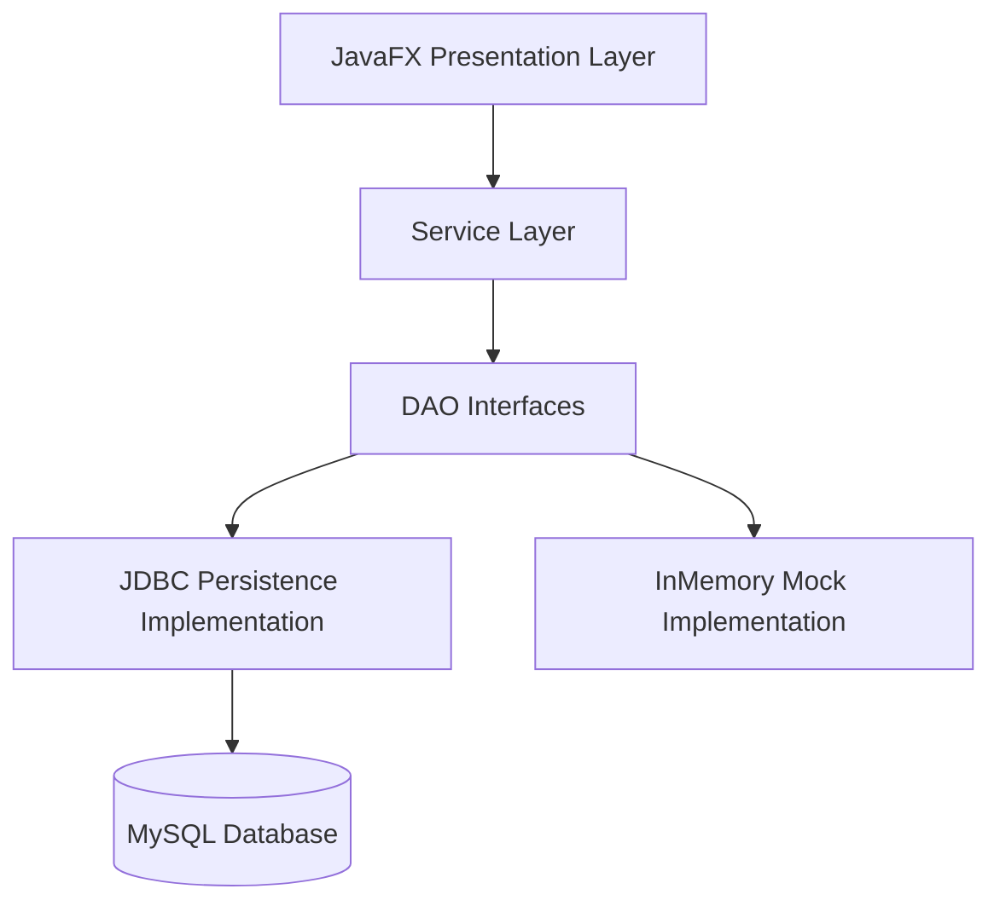

# ArtConnect Pro - Local Art Community Platform

## Overview
ArtConnect Pro is a JavaFX-based management system for local art communities. It allows managing artists, artworks, exhibitions, galleries, workshops, and community members.

This project is a skeleton designed for students to practice:
1. **Layered Architecture**: Presentation, Service, DAO, and Model layers.
2. **Database Persistence**: Implementing JDBC DAOs to connect to a MySQL database.
3. **JavaFX UI**: Working with FXML, TableViews, and Controllers.

## Project Structure
- `com.project.artconnect.MainApp`: Entry point.
- `com.project.artconnect.model`: Domain entities (POJOs/Stubs).
- `com.project.artconnect.dao`: Data Access Object interfaces.
- `com.project.artconnect.persistence`: JDBC implementations (TODO: Students implement these).
- `com.project.artconnect.service`: Business logic layer.
- `com.project.artconnect.ui`: JavaFX Controllers and FXML views.
- `com.project.artconnect.util`: Utility classes like `ConnectionManager` and `ServiceProvider`.

## How to Run
Requirement: Java 17+ and Maven installed.

```bash
mvn clean javafx:run
```

The application runs "out-of-the-box" using **In-Memory Services** (`InMemoryArtistService`, etc.) located in `com.project.artconnect.service.impl`. This allows immediate demonstration of the UI with dummy data.

## OOP-First Design (Object-Oriented Programming)
Unlike typical database-centric skeletons, ArtConnect Pro follows strict OOP best practices:
- **No Explicit IDs**: Model classes (`Artist`, `Artwork`, etc.) do **not** have `id` fields. In Java, an object's identity is its memory address/reference, not a numeric ID.
- **Direct Object References**: Relationships are modeled using direct references. For example, an `Artwork` object holds a reference to an `Artist` object, not an `artistId`.
- **Bidirectional Links**: Many relationships are bidirectional (e.g., an `Artist` has a `List<Artwork>`, and each `Artwork` points back to its `Artist`).
- **No Junction Tables**: Many-to-Many relationships (like Exhibitions and Artworks) are modeled using simple collections (`List<Artwork>`) rather than separate junction classes.

## Student Tasks (The Challenge)
1. **ID Discovery**: Students must "discover" or create IDs at the database level. Your JDBC DAOs will need to map database IDs (Primary Keys) to Java object references during the `findAll` or `save` operations.
2. **Relational Mapping**: You must implement the logic to reconstruct the object graph from relational tables. When fetching an `Artwork`, you must also fetch/link the corresponding `Artist`.
3. **Database Setup**: Create the MySQL database and tables as per the technical requirements (including IDs and Foreign Keys that are NOT visible in the Java models).
4. **JDBC Implementation**: Implement the `Jdbc` DAO classes in `com.project.artconnect.persistence`.
5. **Service Swap**: Update `ServiceProvider` to use your new `Jdbc` DAOs.

## Architecture Diagram


## Testing Instructions
1. Launch the app and verify all 7 tabs show dummy data.
2. Search for an artist by name or filter by discipline in the Artists Tab.
3. View the "Discover" tab to see featured content dynamically generated.
4. Once you implement JDBC, swap the `ServiceProvider` to use your `JdbcArtistDao` and verify data is fetched from MySQL.
